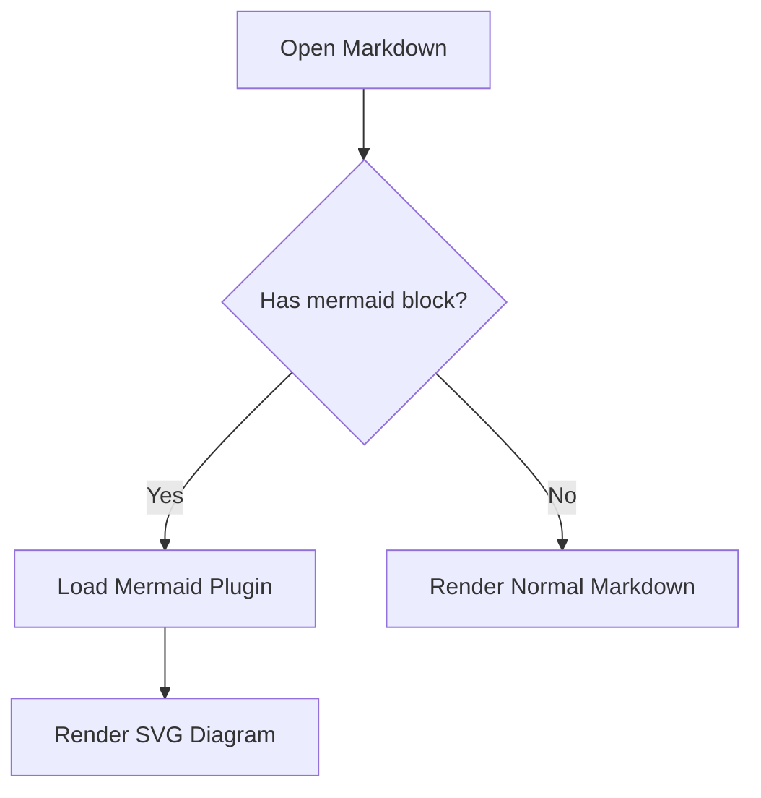
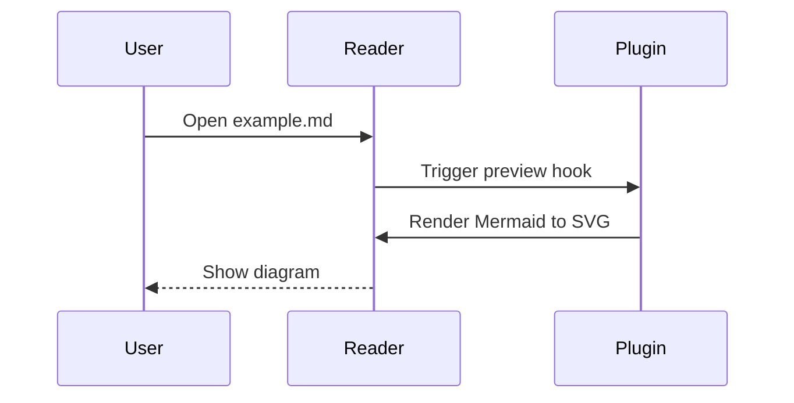
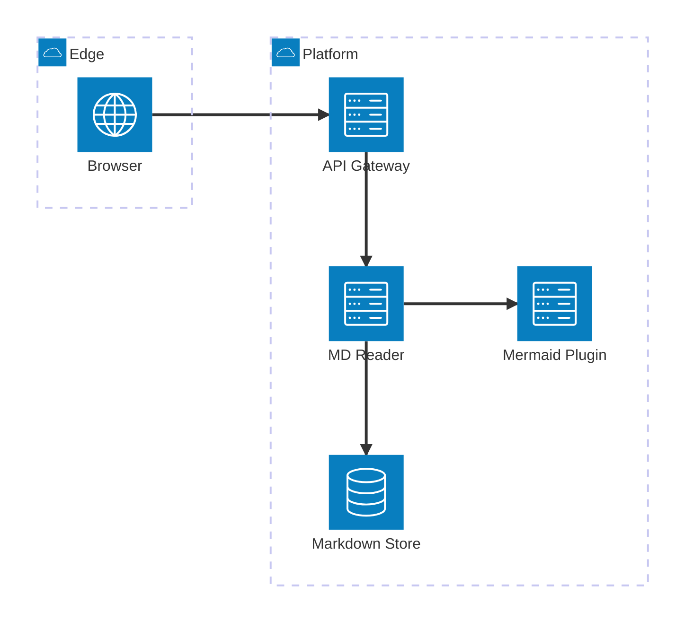

# Mermaid Example

这个示例文件用来验证 Mermaid 插件是否正常工作。

如果插件已启用，下面这段代码块会在预览区被渲染成流程图：

```mermaid
graph TD
  A[Open Markdown] --> B{Has mermaid block?}
  B -- Yes --> C[Load Mermaid Plugin]
  C --> D[Render SVG Diagram]
  B -- No --> E[Render Normal Markdown]
```

你也可以继续追加别的 Mermaid 图类型，例如：

```mermaid
sequenceDiagram
  participant User
  participant Reader
  participant Plugin

  User->>Reader: Open example.md
  Reader->>Plugin: Trigger preview hook
  Plugin->>Reader: Render Mermaid to SVG
  Reader-->>User: Show diagram
```

再补一个 Mermaid 架构图示例：

```mermaid
architecture-beta
    group edge(cloud)[Edge]
    group platform(cloud)[Platform]

    service browser(internet)[Browser] in edge
    service gateway(server)[API Gateway] in platform
    service docs(server)[MD Reader] in platform
    service renderer(server)[Mermaid Plugin] in platform
    service storage(database)[Markdown Store] in platform

    browser:R --> L:gateway
    gateway:B --> T:docs
    docs:R --> L:renderer
    docs:B --> T:storage
```
